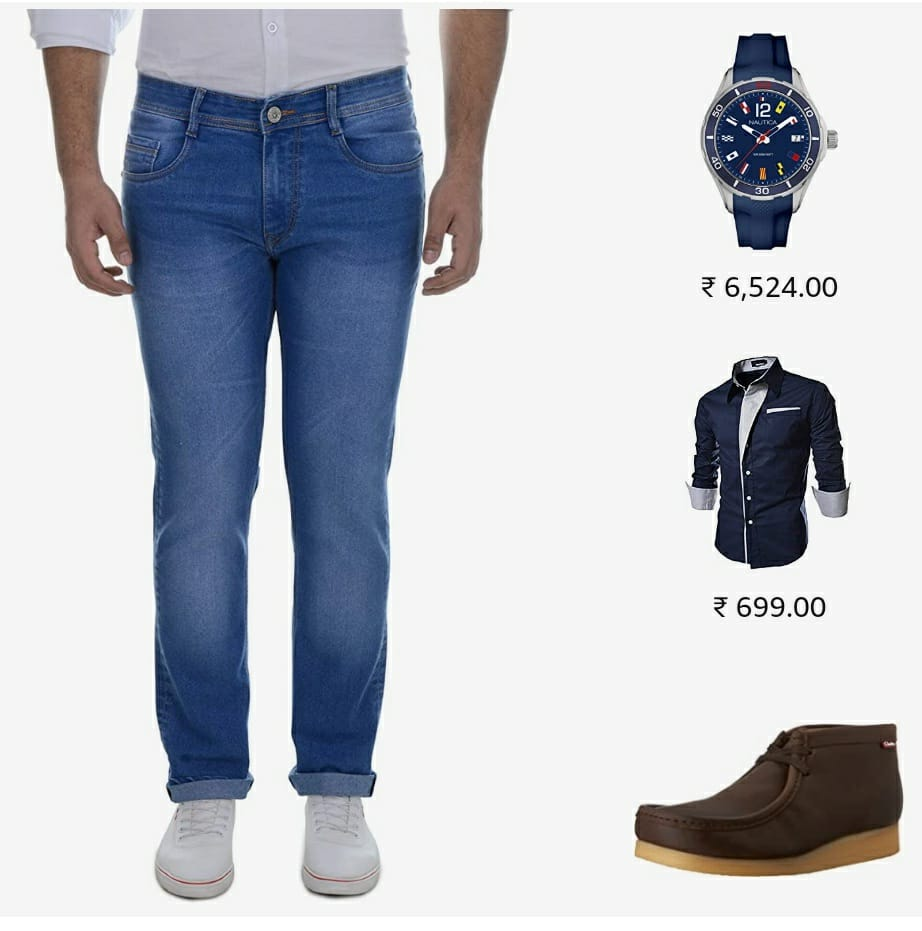

<head>
  <!-- Global site tag (gtag.js) - Google Analytics -->

</head>

### A. Data Scientist, Flipkart

<table style="width:80%;">
  <tr>
    <th width="25%"></th>
    <th width="75%"><b>Complete The Look</b>, Flipkart, Prof. Niloy Ganguly - IIT Kharagpur, Dr. Arnab Bhattacharya, Dr. Aditya Rachakond - Flipkart  
Recommending fashion-compatible outfits given a 'parent' product and introducing diversity in the outfits generated. [<a href="https://harshm121.github.io/Projects/CTL/">More details here</a>]</th> 
  </tr>
	
	
  <tr>
    <th width="25%"></th>
	<th width="75%"><b>Audience Creation for Consumables</b>, Samik Datta - Flipkart  
Creating an audience set for a store at Flipkart's Online Grocery marketplace, called Supermart, based on puchase probability by modelling a user's purchase behaviour and periodicity in buying consumables. [<a href="https://harshm121.github.io/Projects/supermart/">More details here</a>] [prepreint: to be released soon]</th> 
  </tr>

  <tr>
    <th width="25%"></th>
	<th width="75%"><b>Candidate Generation and Ranking</b>, Samik Datta, Dr. Adtiya Rachakonda - Flipkart  
		Customized <b>Bayesian Personalised Ranking</b> based Matrix Factorisation framework for Flipkart homepage recommendation (improvement in clicks by 2 bps on Flipkart homepage, currently in larger A/B testing phase) and designed multiple Lamda MART & LR based rankers for Flipkart home and product page.</th> 
  </tr>
  
</table>

### A. Volunteer, Data Science India vs COVID-19

<table style="width:80%;">
  <tr>
    <th width="25%"></th>
    <th width="75%"><b>COVID-19 Forecasting</b>, Dr. Srujana Merugu, Dr. Alpan Raval - Wadhwani AI  
Created a Machine Learning framework to forecast the upcoming burden on health infrastructure and help public health authorities in planning policies. [<a href="https://harshm121.github.io/Projects/covid_forecasting">More details here</a>] [<a href="https://www.medrxiv.org/content/10.1101/2020.10.19.20215293v1">Extended Abstract</a> published in CoDS-COMAD'21]</th> 
  </tr>
	
	
  <tr>
    <th width="25%"></th>
	<th width="75%"><b>Controlling an Epidemic</b>,  Dr. Srujana Merugu - Wadhwani AI  
Proposed an analytical framework to help create a mobility restriction policy schedule to control an epidemic to a desired leve.[<a href="https://harshm121.github.io/Projects/cosir/">More details here</a>] [prepreint: to be released soon]</th> 
  </tr>

</table>

3. Skin Segmentation (Dr. Prathosh AP, IIT Delhi):
	- The aim of the project is to segment human skin out of Near Infrared Images. Skin segmentation is a solved problem for RGB images but since many night vision cameras use infrared, segmenting images can be useful from infra red images. The problem we faced was to generate data as the data labelling required intense human intelligence. 
	To work around the problem of data, we are trying to use conditional GANs to convert a given RGB image to an NIR image. With this we could use the huge datasets available with RGB images and their skin segmented mask.

4. BoardSnapped (Dr. Prathosh AP, IIT Delhi)

